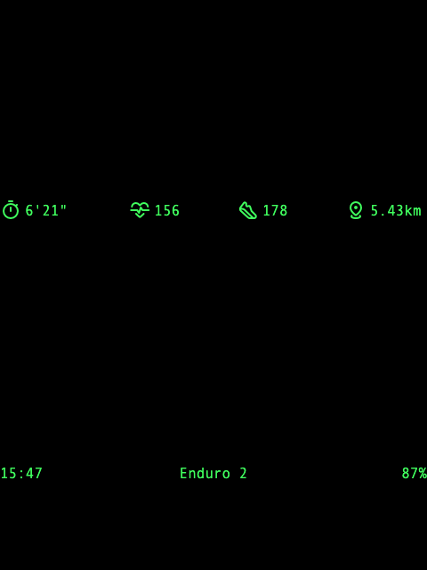

这是一款 Rokid Glasses 应用，用于配合符合低功耗蓝牙标准的设备，如佳明手表，显示运动的实时数据。


## UI 视图




- 窗口底部显示的是常规信息，从左到右依次是
  - 当前时间，24小时制，格式为 `hh:mm`；
  - 已连接的佳明设备名称；
  - Rokid Glasses 当前设备电量百分比；
- 窗口顶部的是运动实时数据栏，从左到右依次是
  - 配速，格式为 `mm'ss"`
  - 心率, 格式为 `999`
  - 步频, 格式为 `999`

UI效果原型参见：[view-480x640](prototype/view-480x640.html)

## 产品特性

基于低功耗蓝牙标准的数据获取，包括但不限于：

- [x] [Heart Rate Service](https://www.bluetooth.com/specifications/specs/heart-rate-service-1-0/)
- [x] [Running Speed and Cadence Service](https://www.bluetooth.com/specifications/specs/running-speed-and-cadence-service/)
- [ ] [Cycling Speed and Cadence Service](https://www.bluetooth.com/specifications/specs/cycling-speed-and-cadence-service/)
- [ ] [Cycling Power Service](https://www.bluetooth.com/specifications/specs/cycling-power-service/)


## 下载安装包

[](https://github.com/hanabix/hubu/releases/latest/download/hubu-release.apk)

## 安装开发包

```bash
./gradlew assembleDebug
adb install -r app/build/outputs/apk/debug/app-debug.apk
```

## 查询安装版本

```bash
adb shell dumpsys package hanabix.hubu | grep versionName
```

## 关于连接

- 自动启动设备扫描，并按发现顺利尝试连接设备，直至满足 HRS / RSCS 数据读取
- 若无可用设备，则显示 `Tap to Reconnect`，可单击重扫

## 已知局限

- 仅支持 RSCS 必要测量数据，即 **速度** 和 **步频** 
- 不支持设备手动选择连接
