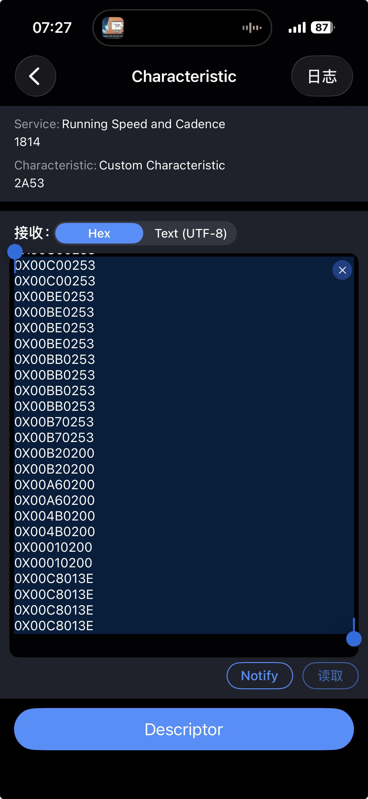

# RSCS 二进制协议规范

基于 Bluetooth [RSCS (Running Speed and Cadence Sensor) v1.0.1](https://www.bluetooth.com/specifications/specs/running-speed-and-cadence-service/) 规范提炼。

---

## 1. 服务与特征 UUID

| 名称 | UUID |
|------|------|
| **RSC Service** | `0x1814` |
| **RSC Measurement** | `0x2A53` |
| **RSC Feature** | `0x2A54` |
| **Sensor Location** | `0x2A5D` |
| **SC Control Point** | `0x2A55` |

---

## 2. RSC Measurement 数据格式（通知/Notify）

**所有数据采用小端序 (Little Endian)**

### 二进制结构

| 字节偏移 | 字段 | 类型 | 说明 | 单位 |
|:---:|------|------|------|------|
| 0 | `Flags` | UINT8 | 标志位（见下表） | - |
| 1-2 | `Instantaneous Speed` | UINT16 | 瞬时速度 | 1/256 m/s |
| 3 | `Instantaneous Cadence` | UINT8 | 瞬时步频 | RPM（步/分钟） |
| 4-5 | `Instantaneous Stride Length` | UINT16 | **条件字段**（Flag Bit 0=1 时存在） | mm |
| 6-9 | `Total Distance` | UINT32 | **条件字段**（Flag Bit 1=1 时存在） | 分米 (dm) |

### Flags 字段位定义（字节 0）

| Bit | 名称 | 含义 |
|:---:|------|------|
| 0 | Stride Length Present | `1` = 包含步长字段 |
| 1 | Total Distance Present | `1` = 包含总距离字段 |
| 2 | Walking or Running Status | `0` = 行走, `1` = 跑步（不支持则固定为 0） |
| 3-7 | Reserved (RFU) | 必须置 0 |

### 示例解析

```
原始数据: 0x03 0x80 0x00 0x5A 0x00 0x01 0x00 0x00 0x04
          │    │         │    │         │
          │    │         │    │         └─ Total Distance: 0x00000400 = 1024 dm
          │    │         │    └─ Stride Length: 0x0100 = 256 mm
          │    │         └─ Cadence: 0x5A = 90 RPM
          │    └─ Speed: 0x0080 = 128 * (1/256) = 0.5 m/s
          └─ Flags: 0x03 = 0b00000011 (步长✓, 总距离✓)
```

### 来自佳明手表实际数据解析示例



截图展示了通过 BLE 调试工具接收到的佳明手表 RSC Measurement 通知数据。

**原始数据**（每条 4 字节，Flags=0x00 表示不包含步长和总距离）:

```
0X00C00253
0X00C00253
0X00BE0253
0X00BE0253
0X00BE0253
0X00BE0253
0X00BB0253
0X00BB0253
0X00BB0253
0X00BB0253
0X00B70253
0X00B70253
0X00B20200
0X00B20200
0X00A60200
0X00A60200
0X004B0200
0X004B0200
0X00010200
0X00010200
0X00C8013E
0X00C8013E
0X00C8013E
0X00C8013E
```

**逐条解析**:

| 原始数据 | Flags | Speed (Hex) | Speed (m/s) | Speed (km/h) | Cadence (RPM) |
|----------|-------|-------------|-------------|--------------|---------------|
| `0X00C00253` | 0x00 | 0x02C0 = 704 | 2.75 | 9.90 | 83 |
| `0X00BE0253` | 0x00 | 0x02BE = 702 | 2.74 | 9.87 | 83 |
| `0X00BB0253` | 0x00 | 0x02BB = 699 | 2.73 | 9.83 | 83 |
| `0X00B70253` | 0x00 | 0x02B7 = 695 | 2.71 | 9.77 | 83 |
| `0X00B20200` | 0x00 | 0x02B2 = 690 | 2.70 | 9.70 | 0 |
| `0X00A60200` | 0x00 | 0x02A6 = 678 | 2.65 | 9.53 | 0 |
| `0X004B0200` | 0x00 | 0x024B = 587 | 2.29 | 8.25 | 0 |
| `0X00010200` | 0x00 | 0x0201 = 513 | 2.00 | 7.22 | 0 |
| `0X00C8013E` | 0x00 | 0x01C8 = 456 | 1.78 | 6.41 | 62 |


